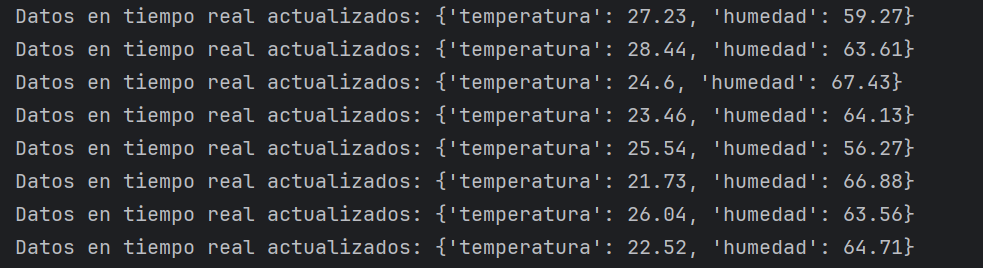

# Laboratorio-6
Laboratorio 6 (Callbacks y Funciones Lambda en Python) 
# Callbacks
## Descripción del Código
El siguiente código implementa una simulación de actualización de datos en tiempo real utilizando números aleatorios para representar la temperatura y la humedad. El objetivo principal es demostrar el uso de una clase `RealTimeDataManager` que utiliza un temporizador para notificar eventos periódicos de actualización de datos a través de un `EventManager`.

## Funcionalidad Destacada

### Simulación de Datos en Tiempo Real:

La clase `RealTimeDataManager` simula la actualización periódica de datos utilizando números aleatorios para la temperatura y la humedad.

### EventManager para Notificaciones:

Se utiliza un `EventManager` para gestionar la suscripción, cancelación y notificación de eventos. En este caso, notifica a los suscriptores cada vez que se actualizan los datos.

### Callback de Notificación:

Se proporciona un callback simple que imprime los datos actualizados en tiempo real al `stdout`.

## Uso del Código

Para ejecutar el código, se crea una instancia de `RealTimeDataManager`, se suscribe un callback al `EventManager`, y luego se inicia la actualización periódica de datos.

## Resultado 

## Discusión de resultados 
El código implementa una simulación de actualización de datos en tiempo real, utilizando números aleatorios para representar la temperatura y la humedad. La utilización de números aleatorios simula de manera efectiva la variabilidad de los datos en tiempo real. Cada actualización genera valores diferentes para la temperatura y la humedad, lo que refleja condiciones dinámicas. Los rangos para la temperatura (20.0 a 30.0) y la humedad (50.0 a 70.0) pueden ajustarse según los requisitos específicos de la aplicación. Esto permite adaptar la simulación a escenarios realistas. El uso del EventManager facilita la gestión de suscriptores. El callback proporcionado se ejecuta cada vez que se notifican cambios, lo que demuestra la eficacia del sistema de eventos para informar a los interesados.
El enfoque del codigo es escalable, ya que permite la suscripción de múltiples callbacks. Si se desea realizar acciones adicionales en respuesta a las actualizaciones de datos, se pueden agregar más callbacks de manera sencilla.

### Conclusión
El código proporciona una base sólida para simular la actualización de datos en tiempo real y notificar a los suscriptores de manera eficaz. La utilización de números aleatorios permite una representación realista de la variabilidad de los datos. La flexibilidad del EventManager y la implementación modular permiten adaptar fácilmente el código para requisitos específicos. En futuras iteraciones, se pueden explorar mejoras, como la integración con datos reales o la expansión de las funcionalidades del EventManager.

# Código de Calculadora con Callbacks y Lambda

## Descripción General:

El siguiente código implementa una calculadora interactiva en Python, permitiendo al usuario realizar operaciones matemáticas básicas como suma, resta, multiplicación y división. La calculadora utiliza funciones de devolución de llamada (callbacks) y funciones lambda para ejecutar las operaciones seleccionadas por el usuario.

## Estructura del Código:

El código se divide en tres funciones principales: `get_user_input`, `ejecutar_operacion`, y `main`.

- **`get_user_input:`** Esta función solicita al usuario que ingrese dos números y la operación deseada. Maneja posibles errores, como la introducción de valores no numéricos, mediante un bloque try-except.

- **`ejecutar_operacion:`** Esta función toma la entrada del usuario y una función de devolución de llamada correspondiente a la operación seleccionada. Utiliza funciones lambda para representar cada operación matemática y ejecuta la operación con los dos números proporcionados. Se manejan excepciones, como la división por cero.

- **`main:`** La función principal del programa. Utiliza un bucle while para mantener la calculadora en funcionamiento hasta que el usuario decida salir. Dentro del bucle, obtiene la entrada del usuario, realiza la operación seleccionada utilizando la función `ejecutar_operacion`, y maneja casos de salida.
## Uso de Funciones Lambda:

En lugar de definir funciones separadas para cada operación matemática, se han utilizado funciones lambda en el diccionario `operations`. Cada función lambda toma dos argumentos (números a operar) y devuelve el resultado de la operación correspondiente. Esto simplifica el código y lo hace más conciso.
operations = {
    '+': lambda x, y: x + y,
    '-': lambda x, y: x - y,
    '*': lambda x, y: x * y,
    '/': lambda x, y: x / y if y != 0 else None
}

## Resultado

## Discución de resultados
El código implementa de manera efectiva una calculadora interactiva en Python. La función get_user_input proporciona una interfaz amigable para que el usuario ingrese números y seleccione la operación deseada. El manejo de errores mejora la robustez del programa al evitar problemas relacionados con entradas no numéricas.
La separación de responsabilidades en funciones como get_user_input y ejecutar_operacion contribuye a una estructura modular y fácil de entender. Cada función realiza una tarea específica, facilitando la comprensión y el mantenimiento del código.
La elección de utilizar funciones lambda para representar las operaciones matemáticas reduce la necesidad de definir funciones separadas y simplifica el código, ya que cada función lambda toma dos argumentos y devuelve el resultado de la operación correspondiente.
El código maneja adecuadamente situaciones excepcionales, como la introducción de valores no numéricos o la división por cero. La inclusión de mensajes de error personalizados mejora la experiencia del usuario al proporcionar retroalimentación comprensible.
